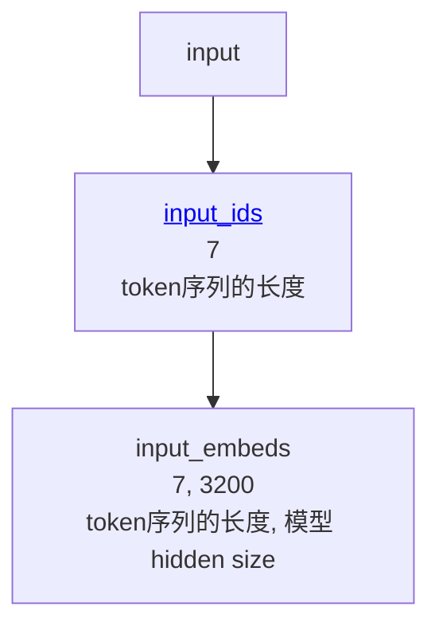

# 整体任务

```python
input = 'Once upon a time, '
```

输入这么几个字符，然后目标是推理后面的字符是什么。最终使用 cpu 经过 open_llama_3b_v2_safetensors 得到的输出应该是 `10 years ago, `

# 分词

```python
input_ids = torch.tensor(tokenizer_encode(cache, 'Once upon a time, '), dtype=torch.long)

def tokenizer_encode(cache: GlobalCache, input: str):
    if cache.sp is None:
        cache.sp = sentencepiece.SentencePieceProcessor()
        cache.sp.load(f'{model_path()}/tokenizer.model')
    return [model_config(cache)['bos_token_id']] + cache.sp.encode(input)
```

第一个输出的 token 固定是 bos，也就是 beginning of sentence，从配置里读取就可以，对应 token 是 1。

分词的字典是从 tokenizer.model 文件加载的，使用了 sentencepiece 库。

最终分词的结果如下

```
input_ids tensor([    1,  4095,  3194,   260,   632, 29522, 29500])
input_ids.shape torch.Size([7])
```

# input_ids => input_embeds

这一步也是查表，把 input_ids 翻译成 input_embds

```python
input_embeds = embed_tokens(cache, input_ids)

def embed_tokens(cache: GlobalCache, input_ids):
    if cache.embed_tokens is None:
        config = model_config(cache)
        cache.embed_tokens = torch.nn.Embedding(
            num_embeddings=config['vocab_size'], # vocab_size=32000
            embedding_dim=config['hidden_size'], # hidden_size=3200
            padding_idx=config['pad_token_id'], # pad_token_id=0
        )
        cache.embed_tokens.weight = torch.nn.Parameter(load_safetensors(cache, 'model.embed_tokens.weight'))
    return cache.embed_tokens.forward(input_ids)

def load_safetensors(cache: GlobalCache, key):
    if cache.safetensors_index is None:
        with open(f'{model_path()}/model.safetensors.index.json') as f:
            cache.safetensors_index = json.loads(f.read())
    safetensor_file = cache.safetensors_index['weight_map'][key]
    with safetensors.safe_open(f'{model_path()}/{safetensor_file}', framework="pt") as f:
        return f.get_tensor(key)
```

embed_tokens 的权重是从训练好的 safetensor 里加载来的。我们写的相当于一个虚拟机，而 safetensor 里的权重才是真正虚拟机里执行的程序。

运行的结果是

```
input_embeds tensor([[ 1.0315e-02,  2.8687e-03,  5.9128e-04,  ..., -1.8845e-03,
         -9.2983e-05, -3.0060e-03],
        [ 3.4027e-03, -1.1047e-02, -6.6833e-03,  ...,  1.2024e-02,
         -1.2207e-02, -4.5166e-03],
        [-7.8125e-03, -3.7842e-03,  2.7344e-02,  ..., -1.3550e-02,
         -8.4839e-03,  1.0986e-02],
        ...,
        [ 1.3367e-02,  1.1520e-03, -4.6082e-03,  ...,  1.1841e-02,
          2.1973e-02,  5.0049e-03],
        [-2.5024e-03,  1.3065e-04, -1.4591e-04,  ..., -1.2207e-04,
         -9.9945e-04, -1.2436e-03],
        [-4.9210e-04, -2.0447e-03,  2.2602e-04,  ...,  8.2016e-04,
         -1.0681e-03, -4.1389e-04]])
input_embeds.shape torch.Size([7, 3200])
```

之前 input_ids 中的每个整数，被替换成了一个 3200 维的浮点数向量。[7, 3200] 也就是 [序列token个数, hidden_size]。

hidden_size 是设计模型的时候，用来控制模型参数个数的设计参数。hidden_size越大，模型就越大。

# 调用 26 次 decode_layer

```python
layer0_output = decode_layer(cache, cache.layers[0], layer_input=input_embeds)
layer1_output = decode_layer(cache, cache.layers[1], layer_input=layer0_output)
layer2_output = decode_layer(cache, cache.layers[2], layer_input=layer1_output)
layer3_output = decode_layer(cache, cache.layers[3], layer_input=layer2_output)
layer4_output = decode_layer(cache, cache.layers[4], layer_input=layer3_output)
layer5_output = decode_layer(cache, cache.layers[5], layer_input=layer4_output)
layer6_output = decode_layer(cache, cache.layers[6], layer_input=layer5_output)
layer7_output = decode_layer(cache, cache.layers[7], layer_input=layer6_output)
layer8_output = decode_layer(cache, cache.layers[8], layer_input=layer7_output)
layer9_output = decode_layer(cache, cache.layers[9], layer_input=layer8_output)
layer10_output = decode_layer(cache, cache.layers[10], layer_input=layer9_output)
layer11_output = decode_layer(cache, cache.layers[11], layer_input=layer10_output)
layer12_output = decode_layer(cache, cache.layers[12], layer_input=layer11_output)
layer13_output = decode_layer(cache, cache.layers[13], layer_input=layer12_output)
layer14_output = decode_layer(cache, cache.layers[14], layer_input=layer13_output)
layer15_output = decode_layer(cache, cache.layers[15], layer_input=layer14_output)
layer16_output = decode_layer(cache, cache.layers[16], layer_input=layer15_output)
layer17_output = decode_layer(cache, cache.layers[17], layer_input=layer16_output)
layer18_output = decode_layer(cache, cache.layers[18], layer_input=layer17_output)
layer19_output = decode_layer(cache, cache.layers[19], layer_input=layer18_output)
layer20_output = decode_layer(cache, cache.layers[20], layer_input=layer19_output)
layer21_output = decode_layer(cache, cache.layers[21], layer_input=layer20_output)
layer22_output = decode_layer(cache, cache.layers[22], layer_input=layer21_output)
layer23_output = decode_layer(cache, cache.layers[23], layer_input=layer22_output)
layer24_output = decode_layer(cache, cache.layers[24], layer_input=layer23_output)
layer25_output = decode_layer(cache, cache.layers[25], layer_input=layer24_output)
```

输入是 input_embeds，最终输出是 layer25_output。然后我们来看一下 decode_layer 的具体实现。

# decode_layer

```python
def decode_layer(cache: GlobalCache, layer: LayerCache, layer_input):
    input_layernormed = input_layernorm(cache, layer, layer_input)
    attn_output = self_attn(cache, layer, input_layernormed) 
    # input_embeds is residual
    attn_output = layer_input + attn_output
    attn_output_layernormed = post_attention_layernorm(cache, layer, attn_output)
    layer_output = mlp(cache, layer, attn_output_layernormed)
    # attn_output is residual
    layer_output = attn_output + layer_output
    return layer_output
```

依次经过了 input_layernorm -> self_attn -> post_attention_layernorm -> mlp 这么几步的处理。layernorm 相对来说比较简单，主要的计算都发生在 self_attn 和 mlp 这两个函数中了。

# layer_input -> input_layernormed

```python
def input_layernorm(cache: GlobalCache, layer: LayerCache, input_embeds):
    return rms_layernorm(cache, input_layernorm_weight(cache, layer), input_embeds)

def input_layernorm_weight(cache: GlobalCache, layer: LayerCache):
    if layer.input_layernorm_weight is None:
        weight = load_safetensors(cache, f'model.layers.{layer.index}.input_layernorm.weight')
        layer.input_layernorm_weight = nn.Parameter(weight)
    return layer.input_layernorm_weight

def rms_layernorm(cache: GlobalCache, weight, input_embeds):
    variance = input_embeds.to(torch.float32).pow(2).mean(-1, keepdim=True)
    input_layernormed = input_embeds * torch.rsqrt(variance + model_config(cache)['rms_norm_eps'])
    input_layernormed = (weight * input_layernormed).to(input_embeds.dtype)
    return input_layernormed
```

rms 是 root mean square 的简写。这一步计算并不会改变输入 tensor 的 shape，只是对每个值按算法进行了大小的缩放。第0层的 input_layernorm 最终的输出是

```
input_embeds tensor([[ 1.0315e-02,  2.8687e-03,  5.9128e-04,  ..., -1.8845e-03,
         -9.2983e-05, -3.0060e-03],
        [ 3.4027e-03, -1.1047e-02, -6.6833e-03,  ...,  1.2024e-02,
         -1.2207e-02, -4.5166e-03],
        [-7.8125e-03, -3.7842e-03,  2.7344e-02,  ..., -1.3550e-02,
         -8.4839e-03,  1.0986e-02],
        ...,
        [ 1.3367e-02,  1.1520e-03, -4.6082e-03,  ...,  1.1841e-02,
          2.1973e-02,  5.0049e-03],
        [-2.5024e-03,  1.3065e-04, -1.4591e-04,  ..., -1.2207e-04,
         -9.9945e-04, -1.2436e-03],
        [-4.9210e-04, -2.0447e-03,  2.2602e-04,  ...,  8.2016e-04,
         -1.0681e-03, -4.1389e-04]])
input_embeds.shape torch.Size([7, 3200])

input_layernormed tensor([[ 0.0425,  0.0116,  0.0035,  ..., -0.0068, -0.0003, -0.0113],
        [ 0.0096, -0.0306, -0.0268,  ...,  0.0297, -0.0286, -0.0116],
        [-0.0239, -0.0114,  0.1189,  ..., -0.0362, -0.0215,  0.0307],
        ...,
        [ 0.0475,  0.0040, -0.0233,  ...,  0.0367,  0.0648,  0.0162],
        [-0.0126,  0.0006, -0.0010,  ..., -0.0005, -0.0042, -0.0057],
        [-0.0022, -0.0090,  0.0014,  ...,  0.0032, -0.0040, -0.0017]])
input_layernormed.shape torch.Size([7, 3200])
```

对比 input_embeds 和 input_layernormed。可以看到大小更均匀一些，但是 shape 都是 [7, 3200]，也就是 [序列token个数, hidden_size]

# self_attn

```python
def self_attn(cache: GlobalCache, layer: LayerCache, input_layernormed):
    config = model_config(cache)
    q_len, _ = input_layernormed.size()
    query_states = q_proj(cache, layer, input_layernormed)
        .view(q_len, config['num_attention_heads'], head_dim(cache))
        .transpose(0, 1)
    key_states = k_proj(cache, layer, input_layernormed)
        .view(q_len, config['num_attention_heads'], head_dim(cache))
        .transpose(0, 1)
    value_states = v_proj(cache, layer, input_layernormed)
        .view(q_len, config['num_attention_heads'], head_dim(cache))
        .transpose(0, 1)
    pos_query_states = apply_rotary_pos_emb(cache, query_states)
    pos_key_states = apply_rotary_pos_emb(cache, key_states)
    unmasked_attn_weights = torch.matmul(pos_query_states, pos_key_states.transpose(1, 2)) / math.sqrt(head_dim(cache))
    causal_mask = causal_mask_of_seq(cache, q_len)
    masked_attn_weights = torch.max(
        unmasked_attn_weights + causal_mask, torch.tensor(torch.finfo(unmasked_attn_weights.dtype).min)
    )
    attn_weights = nn.functional.softmax(masked_attn_weights, dim=-1, dtype=torch.float32).to(pos_query_states.dtype)
    attn_tmp_output1 = torch.matmul(attn_weights, value_states)
    attn_tmp_output2 = attn_tmp_output1.transpose(0, 1)
    attn_tmp_output3 = attn_tmp_output2.reshape(q_len, config['hidden_size'])
    attn_output = o_proj(cache, layer, attn_tmp_output3)
    return attn_output
```

输入的 input_layernormed 其 shape 是 [7, 3200]，也就是 [序列token个数, hidden_size]

输出的 attn_output 其 shape 是 [7, 3200]，也就是 [序列token个数, hidden_size]

self_attn 就是一个极其复杂的变换过程，把 input_layernormed 自己和自己进行一系列权重计算得到输出。


