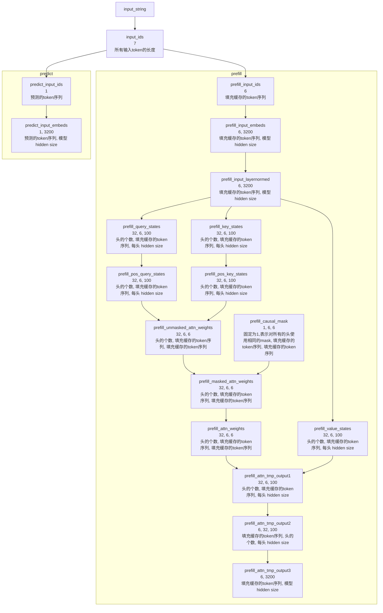

# tensor 之间的依赖关系
* [tensor 之间的计算算法](run-with-kv-cache.py)
* [tensor 的 shape 和具体样本](run-with-kv-cache)

```mermaid
graph TD;
input_string-->input_ids;
input_ids[input_ids<br/>7<br/>所有输入token的长度];
input_ids-->prefill_input_ids;
prefill_input_ids[prefill_input_ids<br/>6<br/>填充缓存的token序列];
input_ids-->predict_input_ids;
predict_input_ids[predict_input_ids<br/>1<br/>预测的token序列];
subgraph prefill;
prefill_input_ids-->prefill_input_embeds; 
prefill_input_embeds[prefill_input_embeds<br/>6, 3200<br/>填充缓存的token序列, 模型 hidden size];
prefill_input_embeds-->prefill_input_layernormed;
prefill_input_layernormed[prefill_input_layernormed<br/>6, 3200<br/>填充缓存的token序列, 模型 hidden size];
prefill_input_layernormed-->prefill_query_states;
prefill_query_states[prefill_query_states<br/>32, 6, 100<br/>头的个数, 填充缓存的token序列, 每头 hidden size];
prefill_input_layernormed-->prefill_key_states;
prefill_key_states[prefill_key_states<br/>32, 6, 100<br/>头的个数, 填充缓存的token序列, 每头 hidden size];
prefill_input_layernormed-->prefill_value_states;
prefill_value_states[prefill_value_states<br/>32, 6, 100<br/>头的个数, 填充缓存的token序列, 每头 hidden size];
prefill_query_states-->prefill_pos_query_states;
prefill_pos_query_states[prefill_pos_query_states<br/>32, 6, 100<br/>头的个数, 填充缓存的token序列, 每头 hidden size];
prefill_key_states-->prefill_pos_key_states;
prefill_pos_key_states[prefill_pos_key_states<br/>32, 6, 100<br/>头的个数, 填充缓存的token序列, 每头 hidden size];
prefill_pos_query_states-->prefill_unmasked_attn_weights;
prefill_pos_key_states-->prefill_unmasked_attn_weights;
prefill_unmasked_attn_weights[prefill_unmasked_attn_weights<br/>32, 6, 6<br/>头的个数, 填充缓存的token序列, 填充缓存的token序列];
prefill_causal_mask[prefill_causal_mask<br/>1, 6, 6<br/>固定为1,表示对所有的头使用相同的mask, 填充缓存的token序列, 填充缓存的token序列];
prefill_unmasked_attn_weights-->prefill_masked_attn_weights;
prefill_causal_mask-->prefill_masked_attn_weights;
prefill_masked_attn_weights[prefill_masked_attn_weights<br/>32, 6, 6<br/>头的个数, 填充缓存的token序列, 填充缓存的token序列];
prefill_masked_attn_weights-->prefill_attn_weights;
prefill_attn_weights[prefill_attn_weights<br/>32, 6, 6<br/>头的个数, 填充缓存的token序列, 填充缓存的token序列];
prefill_attn_weights-->prefill_attn_tmp_output1;
prefill_value_states-->prefill_attn_tmp_output1;
prefill_attn_tmp_output1[prefill_attn_tmp_output1<br/>32, 6, 100<br/>头的个数, 填充缓存的token序列, 每头 hidden size];
prefill_attn_tmp_output1-->prefill_attn_tmp_output2;
prefill_attn_tmp_output2[prefill_attn_tmp_output2<br/>6, 32, 100<br/>填充缓存的token序列, 头的个数, 每头 hidden size];
prefill_attn_tmp_output2-->prefill_attn_tmp_output3;
prefill_attn_tmp_output3[prefill_attn_tmp_output3<br/>6, 3200<br/>填充缓存的token序列, 模型 hidden size];
end;
subgraph predict;
predict_input_ids-->predict_input_embeds;
predict_input_embeds[predict_input_embeds<br/>1, 3200<br/>预测的token序列, 模型 hidden size];
end
```
