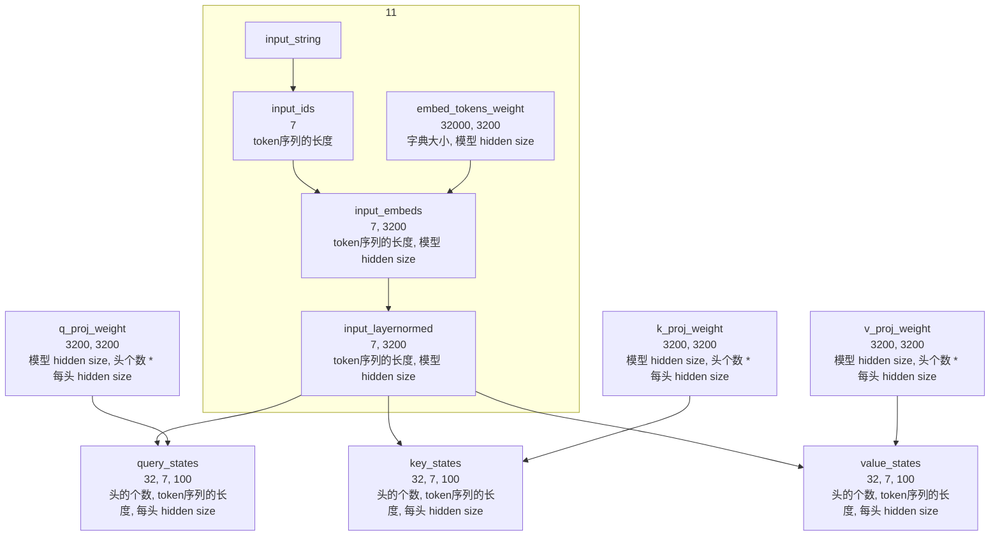

# tensor 之间的依赖关系
* [tensor 之间的计算算法](run-without-batch.py)
* [tensor 的 shape 和具体样本](run-without-batch)

```mermaid
graph TD;
subgraph 11
input_string-->input_ids;
input_ids[input_ids<br/>7<br/>token序列的长度];
embed_tokens_weight[embed_tokens_weight<br/>32000, 3200<br/>字典大小, 模型 hidden size];
input_ids-->input_embeds;
embed_tokens_weight-->input_embeds;
input_embeds[input_embeds<br/>7, 3200<br/>token序列的长度, 模型 hidden size];
input_embeds-->input_layernormed;
input_layernormed[input_layernormed<br/>7, 3200<br/>token序列的长度, 模型 hidden size];
end

q_proj_weight[q_proj_weight<br/>3200, 3200<br/>模型 hidden size, 头个数 * 每头 hidden size];
input_layernormed-->query_states;
q_proj_weight-->query_states;
query_states[query_states<br/>32, 7, 100<br/>头的个数, token序列的长度, 每头 hidden size];

k_proj_weight[k_proj_weight<br/>3200, 3200<br/>模型 hidden size, 头个数 * 每头 hidden size];
input_layernormed-->key_states;
k_proj_weight-->key_states;
key_states[key_states<br/>32, 7, 100<br/>头的个数, token序列的长度, 每头 hidden size];

v_proj_weight[v_proj_weight<br/>3200, 3200<br/>模型 hidden size, 头个数 * 每头 hidden size];
input_layernormed-->value_states;
v_proj_weight-->value_states;
value_states[value_states<br/>32, 7, 100<br/>头的个数, token序列的长度, 每头 hidden size]
```
